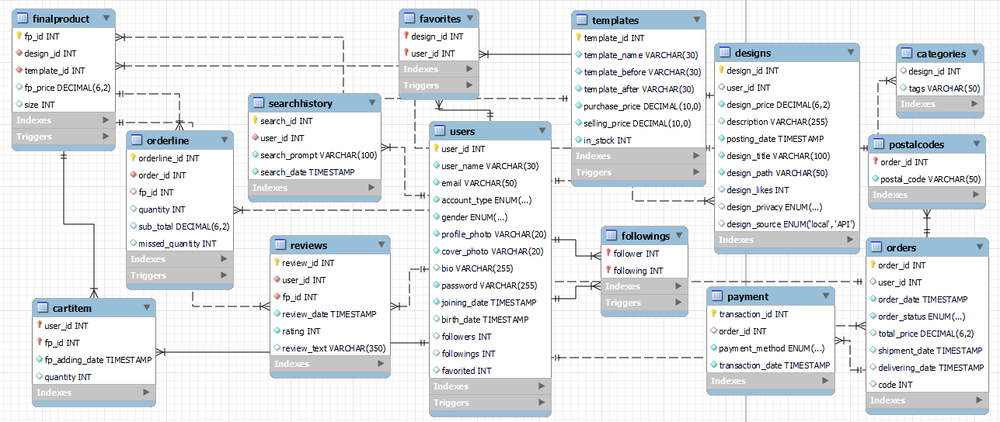

--- 
Title: GitArt High-level Design
Geometry: a4paper, margin=2.5cm
---

 # $${\color{lightgreen}GitArt \space High-Level \space Design}$$

## ${\color{lightgreen}Table \space of \space Contents}$

- [GitArt High-Level Design](#gitart-high-level-design)
    - [Table of Contents](#table-of-contents)
    - [1. Introduction](#1-introduction)
    - [2. System Architecture](#2-system-architecture)
        - [Frontend Layer](#frontend-layer)
        - [Database Basic Design](#database-basic-design)
		- [Backend Layer](#backend-layer)
    - [3. Data Storage and Management](#3-data-storage-and-management)
    - [4. Conclusion](#4-conclusion)

## ${\color{lightgreen}1. \space Introduction}$

GitArt is a online marketplace for print-on-demand products based on user-submitted artwork. This high-level design document introduces the architecture GitArt, focusing on the high-level system design. Our goal is to reproduce the functionalities of the popular website, Redbubble.

## ${\color{lightgreen}2. \space System \space Architecture}$

GitArt website follows a client-server architecture. The three main layers of the system architecture are: the frontend layer, the backend layer, and the database layer, interacting together to deliver an immpressive user experience.

### ${\color{lightgreen}Frontend \space Layer}$

Our frontend design is all about creating a user-friendly and good-looking experience. We've used HTML, CSS, and JavaScript to build a system that's easy to navigate, looks great on different devices, and works smoothly. We've connected the frontend with the backend and other services securely, making sure data is exchanged reliably.
- `HTML` : 
	- used to structure content in our project.
- `CSS` :
	- used for styling and presentation in project.
	- used to control layout of elements in the different pages.
	- used to set color scheme and fontsyles.
	- used for creating responsive design that adapt to various screen-sizes ensuring good user experience.
- `JavaScript` :
	- used to add some interactivity and dynamic behavior to website.
	- used for making forms' validation (ensuring that required fields are filled out correctly before being submitted to server.
	- helped in user interactions (such as clicking buttons.)
	- used with AJAX requests (to implement features like asynchronus image uploads without reloading the entire page.)

#### ${\color{lightgreen}Pages}$

- Explore page:

- Login Page:

- Sign up:

- Upload page:

- Artist profile:

- Admin Page:

- Product details:

- Cart:

### ${\color{lightgreen}Database \space Basic \space Design}$

The database stores information such as user profiles, designs details, procuts details,authentication credentials and order logs.

### ${\color{lightgreen}Backend \space Layer}$

The backend of our full-stack project serves as the backbone, responsible for handling data processing, business logic, and ensuring communication between the user interface and the server. In our project, we used several backend technologies employed to create a robust and efficient backend infrastructure.

- `Node.js` : 
	- A Javascript runtime environment that powers server-side JavaScript for scalable and speedy applications, handling multiple requests without delays.

- `Express.js` :
	- A NodeJs framework that streamlines the process of handling routes, middleware, and HTTP requests with finesse. 

- `AJAX` : 
	- Improves user experience by fetching and updating data without refreshing the entire page. In Node.js, AJAX enhances data retrieval and updates, making web applications more responsive and efficient.
   
- `EJS` : 
	- A template engine to embed JavaScript directly into HTML enhances the development process. This not only simplifies our code but also boosts efficiency by consolidating logic and presentation in a single file
 
- `bcrypt` : 
	- A library for NodeJs that boosts security by safely encrypting passwords. Its advanced hashing defends against potential threats, ensuring user credentials remain protected. 

## ${\color{lightgreen}3. \space Data \space Storage \space and \space Management}$

Our project utilizes MySQL as the Relational Database Management System (RDBMS) for data storage. The database is designed to capture and organize various aspects of the GitArt website, including user information, product details, and order transactions.

#### ${\color{lightgreen}Database \space Schema}$

The database schema is organized into multiple tables to represent different entities within the system. Key entities include `Users`, `Products`, `Orders`, and `Categories` , etc. Relationships between tables are defined to maintain data integrity and support efficient querying.

#### ${\color{lightgreen}Business \space Rules}$
 
- A User may add many Designs. Each Design must be added by exactly one User.
- A User may have many CartItem-s. Each CartItem must belong to only one User.
- A User may order many Orders. Each Order must be ordered by exactly one User.
- A User may like many Favorites. A Favorited design must be liked by one or more Users.
- A User may make many Payments. A Payment must be made by exactly one User.
- A User may have many SearchHistory lines. A SearchHistory line must belong to one User.
- A User may follow many Followings. Each Following must be followed by at least one User.
- An Order may contain many OrderLine-s, each OrderLine must exist in exactly one Order.
- Each FinalProduct has exactly one Template, each Template may be used in many FinalProducts.
- Each Design may be printed on many FinalProducts, each FinalProduct must have only one Design.
- Each Design must belong to at least one Category, each Category must have at least one Design.

## ${\color{lightgreen}4. \space Conclusion}$

The high-level design of GitArt highlights the system architecture, including the frontend, backend, and database layers. It emphasizes the use of JavaScript, Express.js, Node.js, and MySQL to create a scalable and robust web application. We also showed data storage and management strategies optimizing data retrieval and manipulation.
